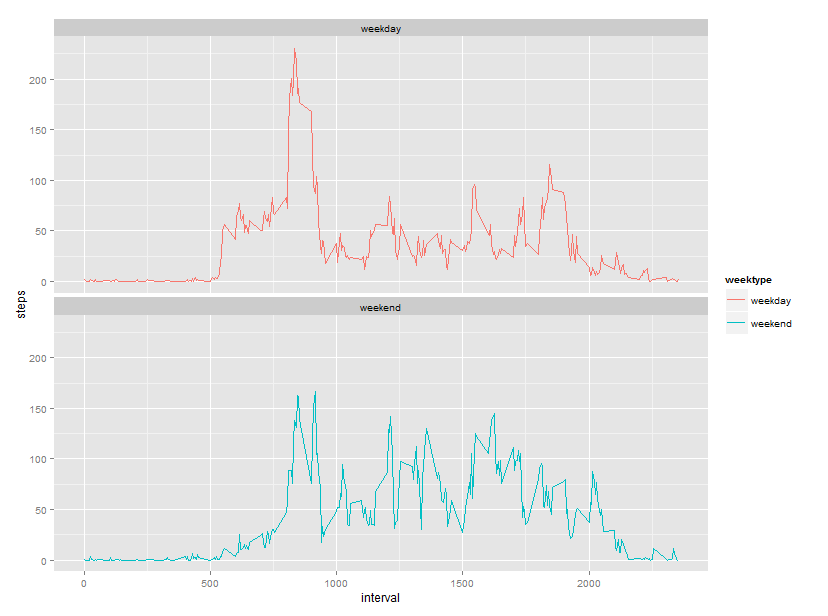

# **Introduction**
This assignment makes use of data from a personal activity monitoring device. This device collects data at 5 minute intervals throughout the day. The data consists of two months of data from an anonymous individual collected during the months of October and November, 2012 and include the number of steps taken in 5 minute intervals each day.

This document presents the results from Project Assignment 1 in the Coursera course Reproducible Research.

## **Verify and load the necessary packages**


```r
if (!require("ggplot2")) {install.packages("ggplot2")}
library(ggplot2)

if (!require("dplyr")) {install.packages("dplyr")}
library(dplyr)

if (!require("lubridate")) {install.packages("lubridate")}
library(lubridate)

if (!require("knitr")) {install.packages("knitr")}
library(knitr)
opts_chunk$set(echo = TRUE)
```

## **Reading the data**

The data is loaded using the `read.csv()`:


```r
if(!file.exists("./CS_course_project1")) {dir.create("./CS_course_project1")}

if(!file.exists("./CS_course_project1/activity.csv"))
{fileUrl <- "https://d396qusza40orc.cloudfront.net/repdata%2Fdata%2Factivity.zip"
 download.file(fileUrl, destfile="./CS_course_project1/activity.zip")
 unzip(zipfile="./CS_course_project1/activity.zip", exdir="./CS_course_project1")}

activity <- read.csv("./CS_course_project1/activity.csv", 
    header = TRUE, sep = "," , na.strings = "NA")
```

## **Tidying the data**

Change the format date using `ymd()`:


```r
activity$date <- ymd(activity$date)
```

Check the data with `str()`, `head()` and `tail()`:


```r
str(activity)
```

```
## 'data.frame':	17568 obs. of  3 variables:
##  $ steps   : int  NA NA NA NA NA NA NA NA NA NA ...
##  $ date    : POSIXct, format: "2012-10-01" "2012-10-01" ...
##  $ interval: int  0 5 10 15 20 25 30 35 40 45 ...
```

```r
head(activity)
```

```
##   steps       date interval
## 1    NA 2012-10-01        0
## 2    NA 2012-10-01        5
## 3    NA 2012-10-01       10
## 4    NA 2012-10-01       15
## 5    NA 2012-10-01       20
## 6    NA 2012-10-01       25
```

```r
tail(activity)
```

```
##       steps       date interval
## 17563    NA 2012-11-30     2330
## 17564    NA 2012-11-30     2335
## 17565    NA 2012-11-30     2340
## 17566    NA 2012-11-30     2345
## 17567    NA 2012-11-30     2350
## 17568    NA 2012-11-30     2355
```

```r
sum(is.na(activity$steps))
```

```
## [1] 2304
```

## **What is mean total number of steps taken per day?**
For this part of the assignment the missing values can be ignored.

1. *Calculate the total number of steps taken per day*
2. *Make a histogram of the total number of steps taken each day*
3. *Calculate and report the mean and median of the total number of steps taken per day*

### **Code and results**

1. Calculate the total number of steps per day using dplyr and group by date:


```r
activity_rm <- activity[which(!is.na(activity$steps)), ]
perday <- activity_rm %>% group_by(date) %>% summarize(steps = sum(steps)) %>%
    print
```

```
## Source: local data frame [53 x 2]
## 
##          date steps
##        (time) (int)
## 1  2012-10-02   126
## 2  2012-10-03 11352
## 3  2012-10-04 12116
## 4  2012-10-05 13294
## 5  2012-10-06 15420
## 6  2012-10-07 11015
## 7  2012-10-09 12811
## 8  2012-10-10  9900
## 9  2012-10-11 10304
## 10 2012-10-12 17382
## ..        ...   ...
```

2. Use base plot for making the histogram:


```r
hist(perday$steps, 10, main = "Total number of steps per day", xlab = "")
```

 

3. Calculate the mean and median of the total number of steps taken per day:


```r
mean_perday <- mean(perday$steps)
mean_perday
```

```
## [1] 10766.19
```

```r
median_perday <- median(perday$steps)
median_perday
```

```
## [1] 10765
```

Mean steps are 10766 and median steps are 10765.

## **What is the average daily activity pattern?**

1. *Make a time series plot (i.e. type = "l") of the 5-minute interval (x-axis) and the average number of steps taken, averaged across all days (y-axis)*
2. *Which 5-minute interval, on average across all the days in the dataset, contains the maximum number of steps?*

### **Code and results**

1. Calculate the average number of steps taken in each 5-minute interval per day using dplyr and group by interval and use ggplot for making the time series of the 5-minute interval and average steps taken:


```r
interval <- activity_rm %>% group_by(interval) %>% summarize(steps = mean(steps))
ggplot(interval, aes(x=interval, y=steps)) + geom_line(color = "blue") +
    labs(title = "Daily Activity Pattern")
```

 

2. Use `which.max()` to find out the maximum steps, on average, across all the days:


```r
max_step <- interval[which.max(interval$steps), ]
max_step
```

```
## Source: local data frame [1 x 2]
## 
##   interval    steps
##      (int)    (dbl)
## 1      835 206.1698
```

The interval 835 has, on average, the highest count of steps, with 206 steps.

## **Imputing missing values**

Note that there are a number of days/intervals where there are missing values (coded as NA). The presence of missing days may introduce bias into some calculations or summaries of the data.

1. *Calculate and report the total number of missing values in the dataset (i.e. the total number of rows with NAs)*
2. *Devise a strategy for filling in all of the missing values in the dataset. The strategy does not need to be sophisticated. For example, you could use the mean/median for that day, or the mean for that 5-minute interval, etc.*
3. *Create a new dataset that is equal to the original dataset but with the missing data filled in*
4. *Make a histogram of the total number of steps taken each day and calculate and report the mean and median total number of steps taken per day. Do these values differ from the estimates from the first part of the assignment? What is the impact of imputing missing data on the estimates of the total daily number of steps?*

### **Code and results**

1. Calculate the number of missing values:


```r
number_na <- sum(is.na(activity$steps))
quote_na <- (number_na / count(activity))*100
number_na
```

```
## [1] 2304
```

Missing values are 2304 equal about 13 percent.

2. Let's take the approach to fill in a missing NA with the average number of steps in the same 5-min interval:


```r
activity_full <- activity
nas <- is.na(activity_full$steps)
```

3. Create a new dataset as the original and use tapply for filling in the missing values with the average number of steps per 5-minute interval:


```r
mean_interval <- tapply(activity_full$steps, activity_full$interval, 
                mean, na.rm=TRUE, simplify=TRUE)
activity_full$steps[nas] <- mean_interval[as.character(activity_full$interval[nas])]
```

Check that there are no missing values:


```r
sum(is.na(activity_full$steps))
```

```
## [1] 0
```

4. Calculate the number of steps taken in each 5-minute interval per day using dplyr and group by date:


```r
steps_full <- activity_full %>% group_by(date) %>% 
                summarize(steps = sum(steps)) %>% print
```

```
## Source: local data frame [61 x 2]
## 
##          date    steps
##        (time)    (dbl)
## 1  2012-10-01 10766.19
## 2  2012-10-02   126.00
## 3  2012-10-03 11352.00
## 4  2012-10-04 12116.00
## 5  2012-10-05 13294.00
## 6  2012-10-06 15420.00
## 7  2012-10-07 11015.00
## 8  2012-10-08 10766.19
## 9  2012-10-09 12811.00
## 10 2012-10-10  9900.00
## ..        ...      ...
```

Create the histogram with base plot:


```r
par(mfrow=c(1,2),  mar = c(4,4,4,0))
hist(perday$steps, 10, main = "Number of steps", xlab = "Steps"
     , ylim =c(0, 25))
abline(v = median(perday$steps), col = "blue", lwd = 3)
hist(steps_full$steps, 10, main = "Number of steps (no NA)", xlab = "Steps",
     ylim =c(0, 25))
abline(v = median(steps_full$steps), col = "blue", lwd = 3)
```

 

Calculate the mean and median steps with the filled in values:


```r
mean_steps_full <- mean(steps_full$steps, na.rm = TRUE)
mean_steps_full
```

```
## [1] 10766.19
```

```r
median_steps_full <- median(steps_full$steps, na.rm = TRUE)
median_steps_full
```

```
## [1] 10766.19
```

The impact of imputing missing data with the average number of steps in the same 5-min interval is that both the mean and the median are equal to the same value: 10766.

## **Are there differences in activity patterns between weekdays and weekends?**

For this part the `weekdays()` will come handy. Use the dataset with the filled-in missing values for this part.

1. *Create a new factor variable in the dataset with two levels - "weekday" and "weekend" indicating whether a given date is a weekday or weekend day*
2. *Make a panel plot containing a time series plot (i.e. type = "l") of the 5-minute interval (x-axis) and the average number of steps taken, averaged across all weekday days or weekend days (y-axis)*

### **Code and results**

Use dplyr and mutate to create a new column, weektype, and apply whether the day is weekend or weekday (notice in this case the labels are in italian language):


```r
activity_full <- mutate(activity_full, 
            weektype = ifelse((weekdays(activity_full$date) == "sabato" | weekdays(activity_full$date) == "domenica"), "weekend", "weekday"))
activity_full$weektype <- as.factor(activity_full$weektype)
head(activity_full)
```

```
##       steps       date interval weektype
## 1 1.7169811 2012-10-01        0  weekday
## 2 0.3396226 2012-10-01        5  weekday
## 3 0.1320755 2012-10-01       10  weekday
## 4 0.1509434 2012-10-01       15  weekday
## 5 0.0754717 2012-10-01       20  weekday
## 6 2.0943396 2012-10-01       25  weekday
```

Calculate the average steps in the 5-minute interval and use ggplot for making the time series of the 5-minute interval for weekday and weekend, and compare the average steps:


```r
interval_full <- activity_full %>% group_by(interval, weektype) %>%
    summarise(steps = mean(steps))

graf <- ggplot(interval_full, aes(x=interval, y=steps, color = weektype)) +
    geom_line() + facet_wrap( ~ weektype, ncol = 1, nrow=2)
print(graf)
```

 

From the two graphs, we can see that the distribution throughout the day is quite different.
